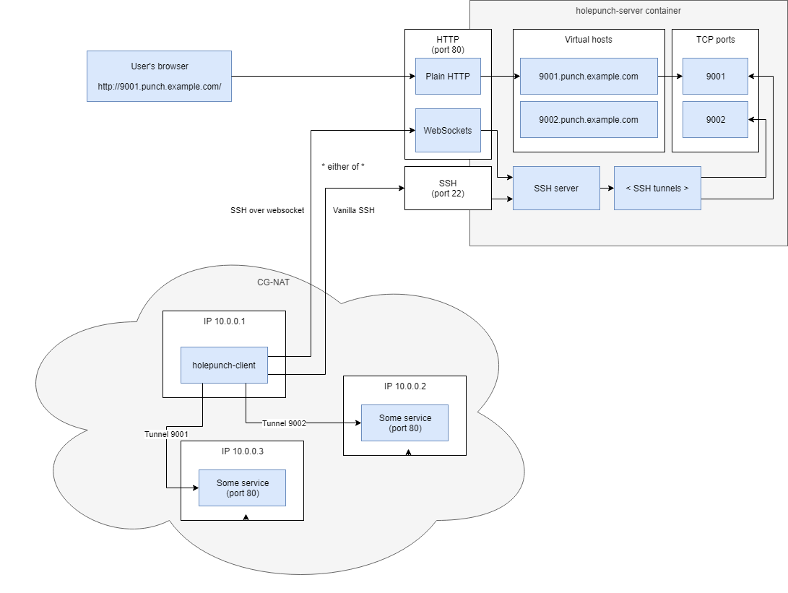

[](https://travis-ci.org/function61/holepunch-server)
[](https://bintray.com/function61/dl/holepunch-server/_latestVersion#files)
[](https://hub.docker.com/r/fn61/holepunch-server/)

holepunch-server
================

Don't you just hate when you want to connect an IoT device behind a mobile connection
to the internet, and you notice you are behind a
[carrier-grade NAT](https://en.wikipedia.org/wiki/Carrier-grade_NAT), and the ISP tries to
persuade you to upgrade to a more expensive plan just to have a public IP?

You can use a SSH reverse tunnel to expose the device's port to internet if you have a
server somewhere. This program takes it a bit further and allows you to multiplex many
different IP:s/ports behind a single HTTP server port, so you don't need to open any ports
in your firewall. Of course this approach works only for those TCP ports that speak HTTP.
And you can use any standard loadbalancer in front of this, if you have edge routing for example.

Essentially this program uses virtual hosting to decide which TCP port to forward traffic to.




Usage, server
-------------

Download suitable server binary for your architecture
(Linux/amd64+arm, Windows/amd64 supported) from the download link.

Generate server host key, then output it as base64:

```
$ ssh-keygen -t ecdsa -b 521 -C "my awesome private key" -f id_ecdsa
$ cat id_ecdsa | base64 -w 0
LS0tLS1CRUdJTi...
```

This will be your ENV variable `SSH_HOSTKEY`

The other ENV variable will be `CLIENT_PUBKEY`. This won't need to be base64 encoded.

The content of that variable you can find from file `id_ecdsa.pub` for the client
([example](https://github.com/function61/holepunch-client#usage)).

Now set up ENV vars and start `holepunch-server`:

```
export SSH_HOSTKEY="..."
export CLIENT_PUBKEY="..."
$ ./holepunch-server server --sshd-websocket --http-reverse-proxy --sshd-tcp 0.0.0.0:22
```

The above command line is if you want all the bells and whistles. If your clients will be
using only Websocket, you might want to disable the SSHd TCP port for reduced attack surface.


Usage, server (Docker)
----------------------

This is also available as a Docker image, which by default only enables SSH Websocket and
HTTP reverse proxy. You need to configure the ENV vars via your favourite deployment tool.


Usage, client
-------------

This server was designed in such a way that, if you want, you can use the native SSH client
to reverse forward the ports-to-be-exposed.

But if you want truly HTTP-only traffic (so you don't have to expose extra ports in your
cluster), to have the WebSockets support you must use
[function61/holepunch-client](https://github.com/function61/holepunch-client) in its
WebSocket mode.


How to build & develop
----------------------

[How to build & develop](https://github.com/function61/turbobob/blob/master/docs/external-how-to-build-and-dev.md)
(with Turbo Bob, our build tool). It's easy and simple!


Similar software
----------------

- https://github.com/jpillora/chisel differences:
    - SSH is used as a protocol, but port forwarding semantics are not used
    - Everything is more bundled together. I feel holepunch-server is more composable
    - Reverse proxying works the other way around?
- https://github.com/alexellis/inlets
